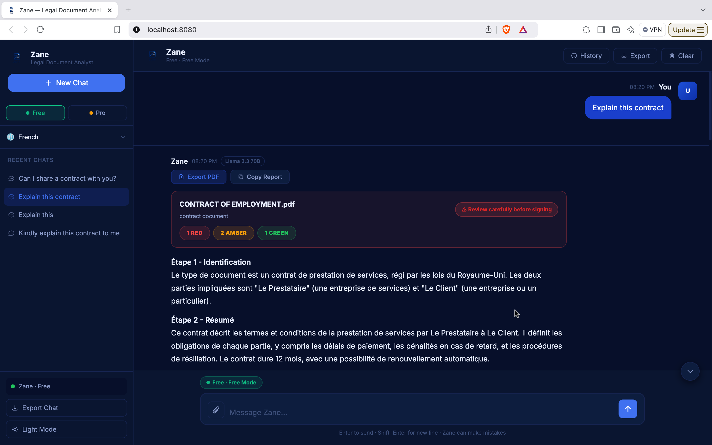
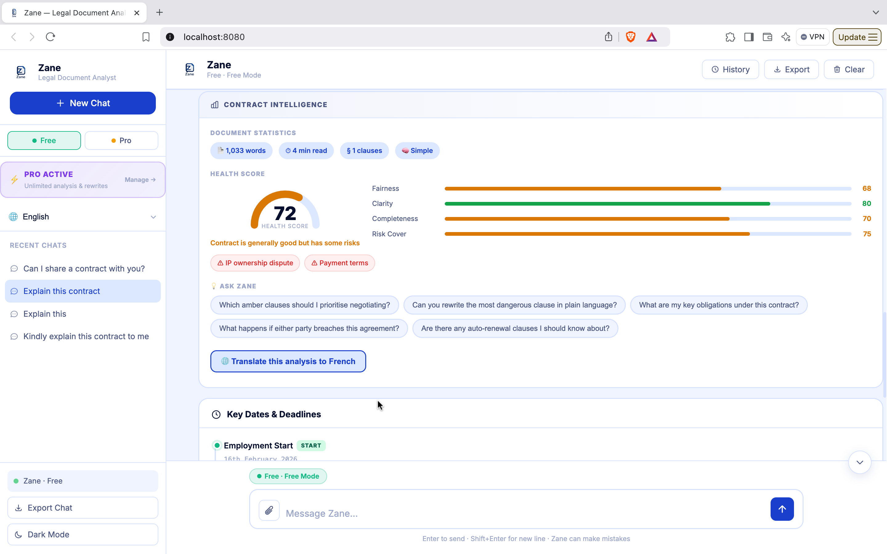
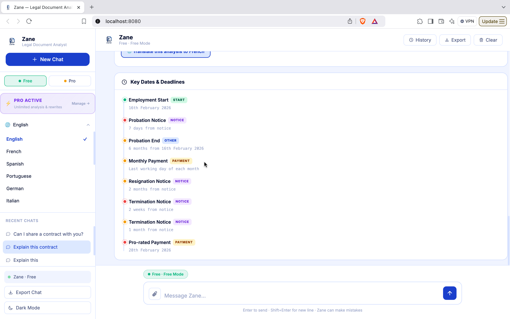
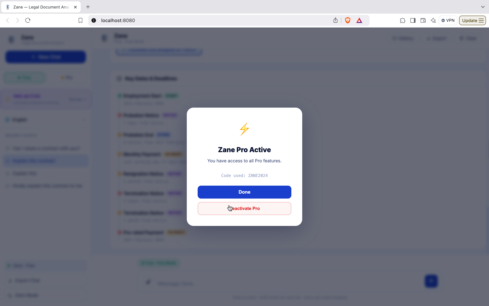
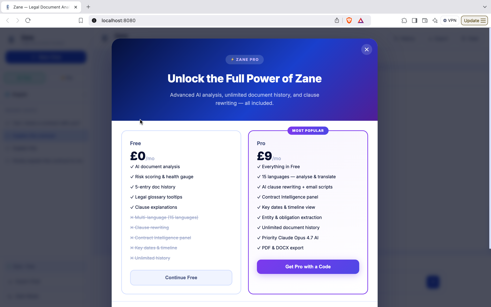

# Zane — AI Legal Document Analyst

> **⚠️ Work in progress.** Core features are live; more on the way.

Zane is an AI-powered legal document analyst built for individuals, freelancers, and small business owners who want to understand contracts without hiring a lawyer. Paste a document or upload a PDF/DOCX, and Zane breaks it down in plain English — flagging risks, explaining clauses, rewriting unfair terms, and extracting key dates.

---

## Screenshots

> More screenshots coming as the UI is finalised.

<!--
| Dark Mode — Chat Analysis | Contract Intelligence Panel |
|---|---|
|  |  |

| Language Selector | Key Dates Timeline |
|---|---|
|  |  |

| Pro Upgrade Page | Manage Pro |
|---|---|
|  |  |
-->

---

## Features

### Core (Free)
- **Plain-English analysis** — Zane reads your document and explains it like a smart friend who knows the law
- **Risk flagging** — RED / AMBER / GREEN colour-coded risk cards for every clause worth knowing about
- **Clause explanations** — click any risk card to get a 4-sentence breakdown and a real-world example
- **Document health score** — animated gauge scoring fairness, clarity, completeness, and risk protection
- **Legal glossary tooltips** — hover over legal terms (indemnification, force majeure, etc.) to see plain-English definitions inline
- **Upload PDF or DOCX** — drag-and-drop or click to upload; supports up to 20 MB
- **Paste raw text** — works without a file; just paste the contract text and go
- **Multi-turn chat** — ask follow-up questions about any part of the document
- **Chat history** — recent conversations saved locally and restored between sessions
- **Document history** — previous analyses saved with risk summary, re-loadable in one click
- **Dark / light mode** — system-aware, toggle in the sidebar
- **Export** — copy full report to clipboard or download as PDF

### Pro (code-activated, payment coming soon)
- **AI clause rewriting** — generates a balanced counter-clause, explains what changed, and writes the negotiation email for you
- **Contract Intelligence panel** — entity extraction (parties, amounts, dates, jurisdiction), obligation matrix, and smart follow-up suggestions
- **Key dates & timeline** — visual timeline of every deadline, payment, renewal, and notice period found in the document
- **Multi-language support** — analyse and chat in 15 languages: French, Spanish, Portuguese, German, Italian, Dutch, Arabic, Chinese, Japanese, Korean, Hindi, Russian, Polish, Turkish
- **Translate analysis** — translate an existing English analysis into your chosen language in one click
- **Priority AI** — powered by Claude Opus 4.7 when configured

---

## Tech Stack

| Layer | Technology |
|---|---|
| Backend | Python · Flask 3.x · SSE streaming |
| Free AI | Groq · `llama-3.3-70b-versatile` |
| Pro AI | Anthropic · `claude-opus-4-7` |
| Document parsing | pdfplumber (PDF) · python-docx (DOCX) |
| Frontend | Vanilla JS · marked.js · DOMPurify · highlight.js · jsPDF |
| Storage | Browser localStorage (chat + doc history) |
| Auth | Promo-code Pro activation (Stripe integration planned) |

---

## Getting Started

### Prerequisites
- Python 3.10+
- A [Groq API key](https://console.groq.com) (free tier available)
- Optional: An [Anthropic API key](https://console.anthropic.com) for Pro/Claude features

### Installation

```bash
git clone https://github.com/fredopoku/MyChatbox.git
cd MyChatbox
python3 -m venv .venv
source .venv/bin/activate      # Windows: .venv\Scripts\activate
pip install -r requirements.txt
```

### Configuration

```bash
cp .env.example .env
```

Edit `.env`:

```env
GROQ_API_KEY=your_groq_api_key_here
ANTHROPIC_API_KEY=your_anthropic_api_key_here   # optional, for Pro/Claude
SECRET_KEY=any_random_string_here
PORT=8080
FLASK_DEBUG=false
PRO_CODES=YOURCODE1,YOURCODE2                    # comma-separated promo codes
```

### Run

```bash
python3 app.py
```

Open [http://localhost:8080](http://localhost:8080).

---

## How It Works

```
User uploads PDF / DOCX / pastes text
        │
        ▼
Flask /upload  ──►  pdfplumber / python-docx  ──►  raw text
        │
        ▼
Flask /chat  ──►  Groq (free) or Anthropic (Pro)
        │         System prompt: Zane legal analyst persona
        │         Steps: Identify → Summarise → Risk flags → Invite action
        ▼
Streaming SSE response rendered in real time
        │
        ▼  (on document analysis completion, Pro users)
Promise.all([/extract, /score])  ──►  Contract Intelligence panel
/timeline  ──►  Key dates timeline
```

**Language support:** the selected language is sent with every request. The system prompt instructs the model to respond entirely in the chosen language, preserving RED / AMBER / GREEN tokens for UI parsing.

---

## API Endpoints

| Method | Endpoint | Description |
|---|---|---|
| `GET` | `/` | Main app |
| `GET` | `/providers` | Which AI providers are configured |
| `GET` | `/languages` | Supported language list |
| `POST` | `/chat` | Main streaming chat/analysis (SSE) |
| `POST` | `/upload` | Extract text from PDF or DOCX |
| `POST` | `/explain` | Explain a specific clause (SSE) |
| `POST` | `/rewrite` | Rewrite a clause with counter-proposal (SSE) |
| `POST` | `/extract` | Entity extraction (parties, dates, amounts) |
| `POST` | `/score` | Contract health scoring |
| `POST` | `/timeline` | Key dates & deadlines extraction |
| `POST` | `/translate` | Translate existing analysis (SSE) |
| `POST` | `/validate-code` | Validate a Pro promo code |
| `POST` | `/clear` | Clear conversation history |

---

## Roadmap

- [ ] Stripe payment integration for Pro subscriptions
- [ ] Screenshot gallery in this README
- [ ] Clause comparison — upload two contracts and diff them
- [ ] User accounts and cloud-synced history
- [ ] Email alerts for contract deadlines
- [ ] Mobile app wrapper
- [ ] Jurisdiction-aware analysis (UK / US / EU / Ghana)
- [ ] Batch analysis — process multiple documents at once

---

## Contributing

This project is under active development. Issues and pull requests are welcome once the core is stable.

---

## Disclaimer

Zane provides document analysis and plain-English explanations — **not legal advice**. For significant contracts, consider having a qualified solicitor review before signing.

---

## License

MIT © Frederick Opoku Afriyie
